👋 Hey, I'm Jayanithyan M R

  
  

  

---

🧑‍💻 About Me

🎓 B.Tech — Artificial Intelligence & Data Science
Velalar College of Engineering and Technology

🎓 BS — Data Science & Applications
Indian Institute of Technology Madras

💻 Interested in Software Engineering, AI & Data

🧠 Strengthening DSA, algorithms and problem solving

🚀 Building real-world applications to understand software beyond the classroom

🤖 Exploring AI engineering and practical AI applications

⚙️ Interested in backend architecture, system design and scalable systems

📚 Learning continuously through projects, experiments and problem solving.

 ---

💻 "$ whoami"

┌──────────────────────────────────────────────────┐
│                                                  │
│  jayanithyan@github:~$ whoami                    │
│                                                  │
│  AI & Data Science Student                       │
│                                                  │
│  jayanithyan@github:~$ focus                     │
│                                                  │
│  > AI Engineering                                │
│  > Backend Systems                               │
│  > System Design                                 │
│  > Distributed Systems                           │
│  > DSA                                           │
│  > Real-World Projects                           │
│                                                  │
│  jayanithyan@github:~$ status                    │
│                                                  │
│  ███████████████████░░  Building...              │
│                                                  │
└──────────────────────────────────────────────────┘

---

⚡ Areas I'm Exploring

 

---

🛠️ Tech Stack

💻 Languages

  

🤖 AI & Data Science

"NumPy" "Pandas" "Matplotlib" "Scikit-learn"

🌐 Frontend

  

⚡ Backend

  

"REST APIs" "WebSockets" "Authentication"

🗄️ Databases

  

☁️ DevOps & Systems

  

"Microservices" "Event-Driven Architecture" "Rate Limiting" "RBAC"

🔧 Tools

  

---

🚀 What I Build

I like building projects that go beyond simply using a framework.

My projects help me understand how different parts of a software system interact:

        User
         │
         ▼
     Frontend
         │
         ▼
       API
         │
         ▼
  Business Logic
         │
    ┌────┴────┐
    ▼         ▼
 Database   Services
    │         │
    └────┬────┘
         ▼
     Deployment

Areas I work with include:

- AI-powered applications
- Full-stack applications
- Backend systems
- REST APIs
- Real-time applications
- Data-driven applications
- Automation
- Containerized applications
- Service-oriented architectures

---

📌 Featured Projects

<table>
<tr><td width="50%">🤖 Aura AI Assistant

An accessibility-focused AI assistant designed to make technology more accessible through intelligent interaction and AI-powered assistance.

Focus

"AI" "Accessibility" "Voice Interaction" "Automation"

</td><td width="50%">🛡️ TexGuard AI

An AI-focused project exploring intelligent text analysis and practical application of AI to a real-world problem.

Focus

"AI" "NLP" "Text Analysis" "Machine Learning"

</td></tr><tr><td width="50%">⚡ FastAPI Backend

A backend project focused on API architecture, authentication, database integration and structured backend development.

Tech

"Python" "FastAPI" "REST API" "Database" "Docker"

</td><td width="50%">🥾 Trekking Management

A management application developed as part of my Modern Application Development coursework.

Tech

"Python" "FastAPI" "HTML" "CSS" "JavaScript"

</td></tr>
</table>---

🧠 My Engineering Loop

        ┌──────────────┐
        │   Discover   │
        └──────┬───────┘
               │
               ▼
        ┌──────────────┐
        │    Learn     │
        └──────┬───────┘
               │
               ▼
        ┌──────────────┐
        │    Build     │
        └──────┬───────┘
               │
               ▼
        ┌──────────────┐
        │    Break     │
        └──────┬───────┘
               │
               ▼
        ┌──────────────┐
        │    Debug     │
        └──────┬───────┘
               │
               ▼
        ┌──────────────┐
        │  Understand  │
        └──────┬───────┘
               │
               ▼
        ┌──────────────┐
        │ Build Better │
        └──────────────┘

---

🧠 LeetCode

  

  

---

📊 GitHub Stats

---

📈 GitHub Contribution Activity

  

  

---

🏆 GitHub Trophies

---

🎯 2026 Focus

🤖 AI & Data

"Machine Learning" • "Data Science" • "AI Engineering" • "LLM Applications"

Building practical AI systems and understanding how intelligent components fit into real applications.

⚙️ Software Engineering

"System Design" • "Backend Architecture" • "Distributed Systems" • "Scalability"

Moving from simply building applications toward understanding how larger software systems are designed.

🧠 Problem Solving

"DSA" • "Algorithms" • "Problem Solving"

Strengthening algorithmic thinking and becoming better at approaching unfamiliar problems.

🚀 Building

"Real-World Projects" • "Open Source" • "Hackathons" • "Technical Experiments"

Learning by building, debugging and continuously improving.

---

🌱 Currently Exploring

---

📚 What I'm Learning

AI Engineering
     │
     ├── Machine Learning
     ├── NLP
     ├── LLM Applications
     └── AI Systems
     
Software Engineering
     │
     ├── Backend Architecture
     ├── APIs
     ├── System Design
     ├── Distributed Systems
     └── Scalability

Problem Solving
     │
     ├── Data Structures
     ├── Algorithms
     ├── Recursion
     ├── Optimization
     └── Competitive Problem Solving

---

🌐 Connect With Me

---

  <b>Build things. Break things. Understand why. Build better.</b>

  <i>Learning continuously. Building intentionally.</i>

  ⚡ One commit at a time.

